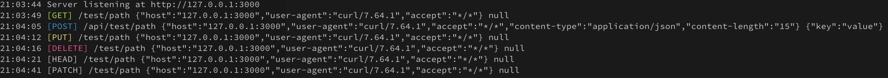

# 4d-pocket

HTTP リクエストを雑に受け取るツール

任意のパスに対する，任意のリクエストメソッドの情報を出力します



# Usage

```
$ npx 4d-pocket -h
Usage: 4d-pocket [options]

Options:
  -V, --version      output the version number
  -p, --port [port]  port (default: "3000")
  -h, --help         display help for command
```

```
$ npx 4d-pocket
21:03:44 Server listening at http://127.0.0.1:3000
21:03:49 [GET] /test/path {"host":"127.0.0.1:3000","user-agent":"curl/7.64.1","accept":"*/*"} null
21:04:05 [POST] /api/test/path {"host":"127.0.0.1:3000","user-agent":"curl/7.64.1","accept":"*/*","content-type":"application/json","content-length":"15"} {"key":"value"}
21:04:12 [PUT] /test/path {"host":"127.0.0.1:3000","user-agent":"curl/7.64.1","accept":"*/*"} null
21:04:16 [DELETE] /test/path {"host":"127.0.0.1:3000","user-agent":"curl/7.64.1","accept":"*/*"} null
21:04:21 [HEAD] /test/path {"host":"127.0.0.1:3000","user-agent":"curl/7.64.1","accept":"*/*"} null
21:04:41 [PATCH] /test/path {"host":"127.0.0.1:3000","user-agent":"curl/7.64.1","accept":"*/*"} null
```

```
$ curl http://127.0.0.1:3000/test/path
$ curl -X POST -H 'Content-Type:application/json' http://127.0.0.1:3000/api/test/path -d '{"key":"value"}'
$ curl http://127.0.0.1:3000/test/path -X PUT
$ curl http://127.0.0.1:3000/test/path -X DELETE
$ curl http://127.0.0.1:3000/test/path -X HEAD
$ curl http://127.0.0.1:3000/test/path -X PATCH
```
